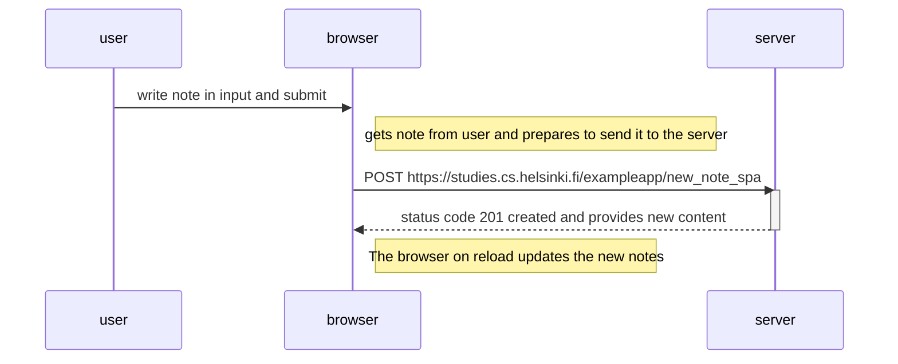

```mermaid
sequenceDiagram
participant user
participant browser
participant server

    user->>browser: write note in input and submit

    Note right of browser: gets note from user and prepares to send it to the server

    browser->>server: POST https://studies.cs.helsinki.fi/exampleapp/new_note_spa
    activate server
    server-->>browser: status code 201 created and provides new content
    deactivate server


    Note right of browser: The browser on reload updates the new notes


```
