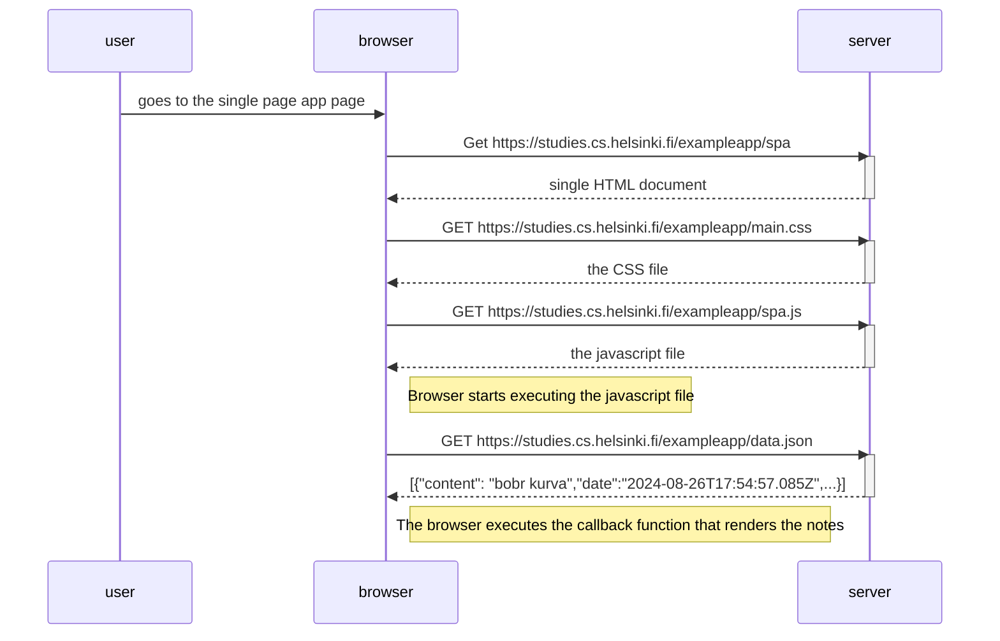

```mermaid
sequenceDiagram
participant user
participant browser
participant server

    user->>browser: goes to the single page app page
    browser->>server: Get https://studies.cs.helsinki.fi/exampleapp/spa
    activate server
    server-->>browser: single HTML document
    deactivate server

    browser->>server: GET https://studies.cs.helsinki.fi/exampleapp/main.css
    activate server
    server-->>browser: the CSS file
    deactivate server

    browser->>server: GET https://studies.cs.helsinki.fi/exampleapp/spa.js
    activate server
    server-->>browser: the javascript file
    deactivate server

    Note right of browser: Browser starts executing the javascript file

    browser->>server: GET https://studies.cs.helsinki.fi/exampleapp/data.json
    activate server
    server-->>browser: [{"content": "bobr kurva","date":"2024-08-26T17:54:57.085Z",...}]
    deactivate server

    Note right of browser: The browser executes the callback function that renders the notes


```
